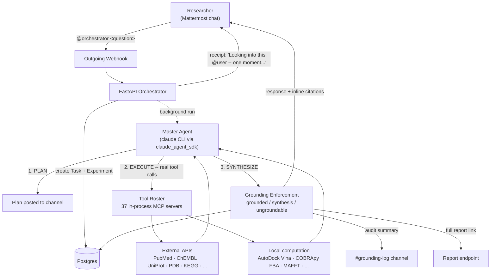

# OpenBioLab

[](LICENSE)
[](orchestrator/pyproject.toml)
[](CHANGELOG.md)

<p align="center">
  
</p>

OpenBioLab connects an LLM to real scientific tools, the databases, structure predictors, docking engines, and simulators a working researcher already uses, and lets it run genuine autonomous experiments instead of just answering questions about them, through a chat interface on [Mattermost](https://mattermost.com) (self-hosted, open source). It's fully open source (MIT) and self-hostable by design: frontier AI-agent tooling for science has mostly shown up behind a paywall or a walled garden, and democratizing real scientific discovery means a grad student, an independent lab, or a researcher anywhere in the world has to be able to stand this up themselves. Every response is `grounded` in a real tool citation, labeled `synthesis`, or explicitly `ungroundable`: there's no fourth option where the model states something it just "recognizes."

## How it works



Every factual claim in step 3 must trace back to an actual tool result from step 2, never restated from the model's own memory, and `app/grounding.py` enforces this structurally: a response can't be persisted as `grounded` without at least one real citation attached.

## Research workflows it can run autonomously

- Target & mechanism research
- Drug discovery triage
- Variant interpretation
- Literature-grounded due diligence
- Systems-level modeling
- Microbiome composition analysis
- Regulatory/commercial due diligence

## Open by design, not just by license

The MIT license is the easy part. What actually makes this open science infrastructure, not just open-source code:

- **Runs on your own machine, under your own control.** Nothing about a research question you ask it has to leave your infrastructure -- self-hosted Mattermost, your own Postgres, your own Docker stack. No API waits on a vendor's roadmap or a subscription tier to get access to a real capability.
- **The tool roster is a pattern anyone can extend**, not a fixed menu: a new scientific tool is a builder file plus a registration line (`CONTRIBUTING.md`'s documented recipe), the same shape every one of the 37 tools wired in today already follows. Every one of them is real, live-verified code, not a wrapper around a promise.
- **Works with a Claude subscription, not just a metered API key** -- the whole point of connecting an LLM to real tools shouldn't come with a second paywall on top of the first.
- **Every claim is checkable against the exact tool call that produced it** -- an open agent that can't show its work isn't meaningfully more trustworthy than a closed one. Grounding isn't a feature flag here; it's enforced in code (`app/grounding.py`) on every single response.

## Getting started

**Prerequisites:** Docker + Docker Compose v2. That's it -- this works the same way on **Mac, Linux, and Windows** (Docker Desktop on Mac/Windows, Docker Engine on Linux); every service, including the `claude` CLI itself, runs inside containers, so nothing OS-specific is required on the host. (The bootstrap script in step 4 needs *some* Python 3.9+ on the host too, but nothing else does.)

**1. Clone and configure**

```bash
git clone https://github.com/RohanV01/AI-BioScientist.git
cd AI-BioScientist
cp .env.example .env
```

Generate two real secrets and paste them into `.env` (`.env.example` ships a placeholder
password and a blank vault key on purpose -- a checked-in shared default is fine for a
five-minute local trial, but not for anything another person can reach):

```bash
# POSTGRES_PASSWORD -- replaces the public dev_only_change_me default
openssl rand -base64 24

# CREDENTIAL_VAULT_KEY -- required before adding any BYO credential (see "BYO credentials" below)
python3 -c "from cryptography.fernet import Fernet; print(Fernet.generate_key().decode())"
```

Keep `CREDENTIAL_VAULT_KEY` somewhere durable outside `.env` too -- losing it makes every
already-stored credential permanently undecryptable, and there's no rotate-in-place migration yet
(re-adding each credential from scratch is the only recovery path).

**2. Bring up the stack**

```bash
docker compose up -d
```
Builds the orchestrator image (Node.js + `claude` CLI baked in -- first run takes a few minutes) and starts Postgres, Mattermost, and the orchestrator together.

**3. Authenticate the agent** -- pick whichever you actually have:
- **Anthropic API key:** set `ANTHROPIC_API_KEY` in `.env`, then `docker compose up -d` again to pick it up. Nothing else to do.
- **Claude subscription (Pro/Max), no API key:** leave `ANTHROPIC_API_KEY` blank and instead run, once:
  ```bash
  docker compose exec -it orchestrator claude auth login
  ```
  It prints a URL + code -- open it in a browser on any device (doesn't have to be this machine) and approve. Credentials land in the `orchestrator_home` Docker volume and persist across restarts; you won't be asked again unless you `docker compose down -v`.

**4. Bootstrap Mattermost** -- creates the admin account, team, bot, and the webhook that wires the agent in (pure Python, same command on every OS, no bash/curl/jq needed):

```bash
python scripts/bootstrap_mattermost.py
```
Prints the generated admin password once (also saved to `.env`). Under "Next steps," it prints a ready-to-run `seed_dev_data.py` command with the real `--team-id`/`--bot-user-id`/`--bot-token`/`--grounding-log-channel-id` values filled in -- copy that exact line for the next step. **Don't skip `--bot-token`**: without it the seeded agent has no way to post replies in Mattermost at all, and the failure is silent from the chat side (only visible in `docker compose logs orchestrator` as "Agent ... has no bot token configured").

**5. Seed the agent's tool roster** -- run inside the container (there's no host Python venv on a fresh clone), using the exact command step 4 printed:

```bash
docker compose exec orchestrator python scripts/seed_dev_data.py --team-id <...> --bot-user-id <...> --bot-token <...> --grounding-log-channel-id <...>
```

**6. Restart the orchestrator** to pick up the webhook secret bootstrap just wrote to `.env`:

```bash
docker compose up -d --force-recreate orchestrator
```
⚠️ Don't skip this -- if the orchestrator container is still holding the old (or no) secret, `@orchestrator` messages get silently rejected (a 403 that never surfaces in Mattermost's UI at all -- the channel just goes quiet). If step 7 below doesn't respond, this is the first thing to check.

**7. Use it**

Go to `http://localhost:8065`, log in with the admin credentials step 4 printed, open `#town-square`, and message `@orchestrator <your question>` to talk to the agent.

**Optional bulk data:** none of the above requires it. If you have (or want to build) a local bibliographic/database corpus, see `data/README.md`. It's gitignored and every agent degrades gracefully without it (`docs/05-ux-behavior.md` §1).

**BYO credentials:** metered tools (like Hugging Face) need your own API key. Add one with `orchestrator/scripts/add_credential.py`; it's encrypted at rest (`orchestrator/app/vault.py`) and never hardcoded to any one account.

**Full-text paper downloads work out of the box.** `download_paper` (`orchestrator/app/tools/literature_discovery.py`) tries a direct open-access download first (no browser involved) and falls back to the [Camofox stealth browser](https://github.com/jo-inc/camofox-browser) for genuinely paywalled DOIs, driving the real Sci-Hub UI (paste the DOI, click open, click the page's own save button) and capturing the resulting browser download. `docker compose up -d` already starts Camofox as its own service (`ghcr.io/jo-inc/camofox-browser`, no separate clone/install step needed) -- `.env.example`'s defaults point the orchestrator at it correctly. The only thing worth customizing is `SCIHUB_MIRROR_URLS` in `.env` (comma-separated Sci-Hub mirrors; list every one you know is currently working, since mirrors go down/get blocked independently) -- `.env.example` ships a reasonable starting list already.

Every download is checked against the paper's own expected title/DOI (`_verify_pdf_content` in `literature_discovery.py`) before anything downstream trusts it -- a real browser download can succeed end-to-end while a Sci-Hub mirror quietly serves the wrong paper's PDF for a given DOI (seen live during testing). A flagged mismatch is reported in `download_paper`'s own result text, and `read_paper` refuses to extract "findings" from a file flagged that way.

**Research experiments.** Every research investigation gets its own folder (`data/Experiments/<id>/`) and DB row -- control it with the `/experiment` Slash Command (`start ["name"]` / `end` / `status` / `conclude`), or just message `@orchestrator` and one opens automatically. Register the command once per Mattermost instance:
```bash
# 1. Get a session token by logging in as the admin account step 4 created
#    (same login-endpoint trick bootstrap_mattermost.py itself uses --
#    the token comes back in the response's Token header, not the body).
ADMIN_TOKEN=$(curl -si -X POST http://localhost:8065/api/v4/users/login \
  -d '{"login_id": "admin", "password": "<the admin password step 4 printed>"}' \
  | grep -i '^Token:' | tr -d '\r' | cut -d' ' -f2)

# 2. Get your team id (also printed by step 4, if you still have that output).
TEAM_ID=$(curl -s http://localhost:8065/api/v4/teams/name/openbiolab \
  -H "Authorization: Bearer $ADMIN_TOKEN" | python3 -c "import json,sys; print(json.load(sys.stdin)['id'])")

# 3. Register the command. url is the orchestrator's container-network
#    address (Mattermost calls it via Docker's internal DNS, the same
#    "orchestrator" hostname bootstrap_mattermost.py's own webhook uses) --
#    not localhost, even though you reach Mattermost itself at localhost.
curl -X POST http://localhost:8065/api/v4/commands \
  -H "Authorization: Bearer $ADMIN_TOKEN" -H 'Content-Type: application/json' \
  -d "{\"team_id\": \"$TEAM_ID\", \"trigger\": \"experiment\", \"method\": \"P\",
       \"url\": \"http://orchestrator:8000/webhooks/mattermost/experiment\",
       \"auto_complete\": true, \"display_name\": \"Experiment\",
       \"description\": \"Controls the current research experiment for this channel\"}"
```
Copy the response's own `token` field into `.env` as `MATTERMOST_EXPERIMENT_COMMAND_SECRET` (a separate value from `MATTERMOST_WEBHOOK_SECRET` -- Mattermost auto-generates one token per integration, no way to set a custom one), then `docker compose up -d --force-recreate orchestrator` to pick it up.

`read_paper`'s structured extraction and `/experiment conclude`'s synthesis run through a modular one-shot LLM backend (`orchestrator/app/llm_backend.py`), not tied to any single provider: it tries a real Anthropic API key (`ANTHROPIC_API_KEY`), then a local [LM Studio](https://lmstudio.ai) server (`LM_STUDIO_BASE_URL`), then falls back to the `claude` CLI's own subscription login from step 5 above -- so both features work with zero extra setup if you already logged in there. Set `LLM_BACKEND` in `.env` to pin one explicitly instead of the default `auto` fallback chain.

## Contributing

New tool sources, new workflow combos, bug reports -- all welcome. `CONTRIBUTING.md` documents the exact recipe for wiring in a new scientific tool; if this project's mission (open, self-hostable, verifiable AI-driven science) resonates, the fastest way to help is adding one.

## Acknowledgments

OpenBioLab is an orchestrator, not a reimplementation. It's only useful because of the open platforms, databases, and tools it wires together:

- **Platform:** [Claude Agent SDK](https://github.com/anthropics/claude-agent-sdk-python) (agent runtime), [Mattermost](https://mattermost.com) (chat interface), [Camofox](https://github.com/jo-inc/camofox-browser) (paywalled full-text retrieval), [LM Studio](https://lmstudio.ai) (optional local LLM backend)
- **Data & tool sources:** [PubMed](https://pubmed.ncbi.nlm.nih.gov)/[OpenAlex](https://openalex.org), [ChEMBL](https://www.ebi.ac.uk/chembl/), [Open Targets](https://platform.opentargets.org), [UniProt](https://www.uniprot.org), [PDB](https://www.rcsb.org), [AlphaFold DB](https://alphafold.ebi.ac.uk), [Ensembl](https://www.ensembl.org), [ClinVar](https://www.ncbi.nlm.nih.gov/clinvar/), [gnomAD](https://gnomad.broadinstitute.org), [KEGG](https://www.genome.jp/kegg/), [Reactome](https://reactome.org), [STRING](https://string-db.org), [ClinicalTrials.gov](https://clinicaltrials.gov), [DailyMed](https://dailymed.nlm.nih.gov)
- **Local computation:** [AutoDock Vina](https://github.com/ccsb-scripps/AutoDock-Vina) (docking), [COBRApy](https://opencobra.github.io/cobrapy/) (flux balance analysis), [scikit-bio](http://scikit-bio.org) (diversity statistics), [BioPandas](http://rasbt.github.io/biopandas/) (structure parsing), [MAFFT](https://mafft.cbrc.jp/alignment/software/) (sequence alignment)
- **Demo media:** built HTML to video via [HyperFrames](https://github.com/heygen-com/hyperframes)

## Change history

See [`CHANGELOG.md`](CHANGELOG.md).
