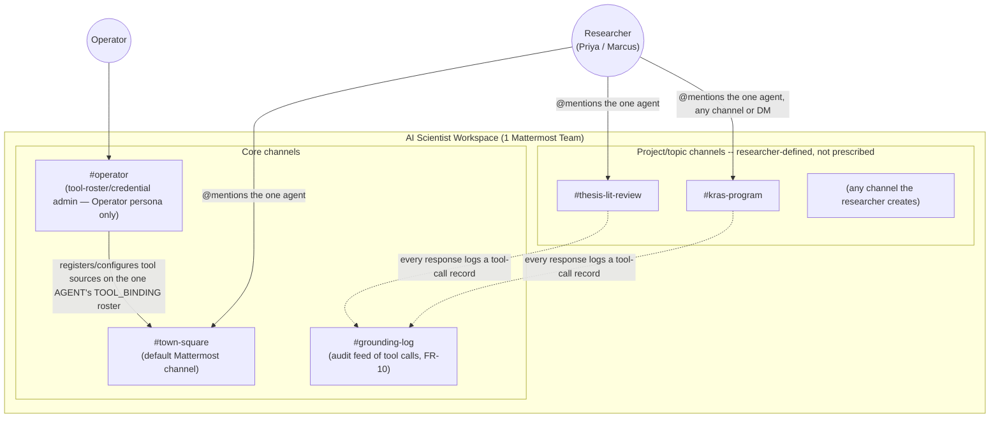
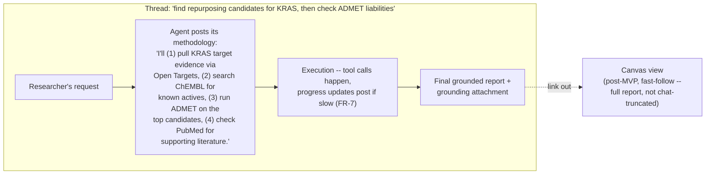

# Information Architecture

## Architecture pivot (2026-08-15)

Superseded: this document originally organized the workspace around one channel and one bot per research-report domain cluster, with a separate `#flagship-pipelines` channel for cross-domain hand-offs. **That's not the product** — see `07-system-architecture.md`'s pivot note. There is one master agent with the full tool roster; every query goes to it, regardless of topic, and it decides internally which tools a given request needs. Domain clusters remain a useful way to *talk about* the tool roster (this doc's Discovery section still uses them), but they no longer map to separate channels or bot accounts.

## Structuring principle

Mattermost's own hierarchy (Team → Channel → Thread → Message) is reused as-is rather than inventing a parallel structure. The mapping onto this project now:

- **One Team** = one org/deployment (single-tenant at MVP; see `02-prd.md` scope).
- **One Bot Account** — the master orchestrator agent — `@mentionable`/DM-able from anywhere in the team, not confined to a domain channel.
- **Channels organize by research topic/project, not by tool domain.** A researcher might have `#kras-program` or `#thesis-lit-review` — whatever grouping makes sense for their own work — and message the same one agent in any of them. The platform doesn't prescribe channel structure beyond the core ones below.
- **Threads** are the task-delegation unit — a request, the agent's stated methodology, its execution, and its final grounded report all live in one thread.
- **Message attachments** carry structured output (the methodology, grounding blocks, tables) — chat text stays conversational, attachments carry the data.

## Top-level map

## Per-thread structure (detail)

Every delegated task follows the same internal pattern, regardless of which tools it ends up needing:

This is the concrete shape of the "puzzle pieces assembled differently each time" pattern: the Plan step names which tools (pieces) it's reaching for and in what order, before Execution touches any of them — the researcher sees the assembly plan, not just the finished puzzle.

## Navigation model

- **Discovery:** a researcher new to the platform doesn't need to learn a channel map — there's one bot to talk to. The pinned message in `#town-square` (or wherever the bot is first used) explains what it can do and points to the tool roster (which grows over time, per Section 7's wrapping strategy) rather than a fixed set of specialist channels.
- **Delegation:** `@mention` in any channel, or DM the bot directly for a private/IP-sensitive task (supports Marcus's persona requirement) — no need to pick "the right" channel first, since there isn't a per-domain one anymore.
- **Multi-tool tasks:** what used to require a separate `#flagship-pipelines` channel and cross-bot hand-off is now just... a task. The one agent's Plan step already spans however many tools a request needs; there's no cross-agent coordination to surface separately, because there's only one agent.
- **Audit:** `#grounding-log` is a read-only feed (Operator + anyone auditing) of every tool call the agent has made — the human-facing surface of FR-10.

## What's deliberately *not* here

- No custom web app for MVP navigation — Mattermost's own team/channel/thread UI is the entire information architecture at this stage. A canvas/side-panel (Section 11 of the research report) is scoped as a fast-follow, reachable via link-out from a message attachment.
- No per-domain channel structure — dropped in this pivot. Channel organization is left to the researcher (by project, by topic, however they'd naturally split their own work), not prescribed by the platform's tool taxonomy.
- No separate "which bot do I ask" decision for the user to make — that routing logic now lives entirely inside the one agent's own planning step, not in the information architecture.

## Related documents

`05-ux-behavior.md` · `07-system-architecture.md` · `08-cross-feature-journeys.md`
