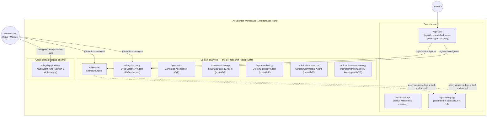
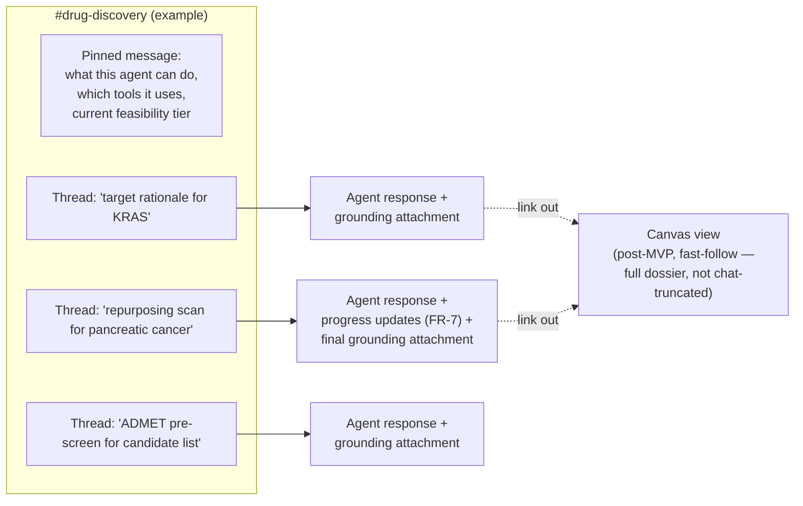

# Information Architecture

## Structuring principle

Mattermost's own hierarchy (Team → Channel → Thread → Message) is reused as-is rather than inventing a parallel structure — one of the reasons Mattermost was chosen over a custom UI (see `07-system-architecture.md`). The mapping onto this project's domain:

- **One Team** = one org/deployment (single-tenant at MVP; see `02-prd.md` scope).
- **One Channel per agent-domain** (mirroring the research report's 7 clusters), plus a small number of cross-cutting channels.
- **Bot Accounts**, one per agent, live inside their domain channel and are `@mentionable` from any channel the researcher is in.
- **Threads** are the task-delegation unit — a researcher's request and the agent's grounded response (plus any follow-up) live in one thread, keeping the parent channel scannable.
- **Message attachments** carry structured output (grounding blocks, tables, tier ratings) — chat text stays conversational, attachments carry the data.

## Top-level map

## Per-channel structure (detail)

Each domain channel follows the same internal pattern:

## Navigation model

- **Discovery:** a researcher new to the platform sees the channel list itself as the feature catalog — channel names and pinned "what this agent can do" messages replace a separate docs site for day-to-day use (the research report's Section 4 cluster names map directly to channel names, so the report *is* the channel directory).
- **Delegation:** `@mention` in any channel, or DM the bot directly for a private/IP-sensitive task (supports Marcus's persona requirement).
- **Cross-agent tasks:** the `#flagship-pipelines` channel is where a task spans multiple agents (e.g. Flagship 5.5's target-to-lead funnel, which chains Drug Discovery + Structural Biology). The Orchestrator Service coordinates the hand-off between agents; the researcher sees one thread, not several.
- **Audit:** `#grounding-log` is a read-only feed (Operator + anyone auditing) of every tool call made across all agents — the human-facing surface of FR-10.

## What's deliberately *not* here

- No custom web app for MVP navigation — Mattermost's own team/channel/thread UI is the entire information architecture at this stage. A canvas/side-panel (Section 11 of the research report) is scoped as a fast-follow, reachable via link-out from a message attachment, not a parallel navigation system to design and maintain from day one.
- No per-user customizable channel structure — the domain-cluster mapping is fixed and shared org-wide, matching how the research report's clusters are a stable taxonomy, not a per-user preference.

## Related documents

`05-ux-behavior.md` · `07-system-architecture.md` · `08-cross-feature-journeys.md`
