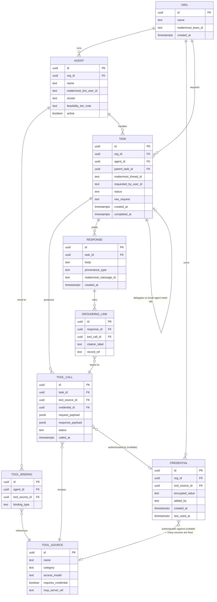

# Data Model

## Scope

This covers the **Orchestrator Service's own schema** — the tables the new code owns. Mattermost owns its own schema (Postgres, its own migrations, not modified by this project — see `07-system-architecture.md` for why Mattermost is treated as a dependency, not a fork). RxDis owns its own Supabase schema (kept as-is at MVP; see Open Question in `02-prd.md`). The bulk data assets (`data/scihub.sql`, `data/Databases/`) are treated as read-only source data that tool wrappers query, not data this schema duplicates wholesale.

## Entity overview

## Key design decisions

**`TASK.parent_task_id` (self-referential)** — models multi-agent flagship-pipeline delegation (UX Behavior §5) as a tree: a parent task in `#flagship-pipelines` spawns child tasks per contributing agent, each with its own `TOOL_CALL`/`RESPONSE` records, and the parent's final response aggregates them. This directly supports the "partial-dossier presentation" requirement — if a child task fails, the parent can report exactly which sub-agent's contribution is missing.

**`RESPONSE.provenance_type`** — enum: `grounded` (has ≥1 `GROUNDING_LINK`), `synthesis` (model reasoning over grounded facts, labeled as such per UX Behavior §2), `ungroundable` (agent explicitly says it can't source this — FR-5). This field exists specifically so the "never present an ungrounded claim as fact" rule (Section 11 of the research report) is enforced structurally: a response can't be rendered without declaring which of these three it is.

**`TOOL_SOURCE.access_model`** — enum matching Section 8 of the research report: `free_public`, `free_metered` (e.g. OpenAlex's authenticated tier), `commercial_license`, `controlled_access`. Drives whether `CREDENTIAL` is required and which BYO-onboarding path the Operator uses.

**`CREDENTIAL.encrypted_value` + `last_used_at`** — the per-org credential vault from Section 8/11. Encrypted at rest (see `07-system-architecture.md` for the key-management approach); `last_used_at` is the seed of the audit trail Section 8's architecture pattern calls for. At MVP scope (single-org), this table exists but the *security hardening* around it (key rotation, access logging depth) is explicitly deferred — see `02-prd.md` scope and the research report's Appendix note that this still needs real security design.

**`TOOL_CALL.request_payload` / `response_payload` as `jsonb`** — kept generic rather than one table per tool source, because the tool inventory is large and growing (Section 7's wrapping strategy adds new `TOOL_SOURCE` rows over time without requiring new tables). Downside accepted deliberately: no schema-level validation of any one tool's payload shape — validation lives in the MCP wrapper code, not the database.

## What's *not* modeled here (and why)

- **The bulk bio databases (`data/Databases/`, `data/scihub.sql`) are not imported into this schema.** They're queried in place by tool wrappers (a ChEMBL wrapper reads `data/Databases/chembl/`, a literature-enrichment wrapper reads `data/scihub.sql`). Duplicating 82GB of data into the Orchestrator's own Postgres instance is neither necessary nor local-first-friendly at this scale — see `07-system-architecture.md` for how these are accessed.
- **DOI corpus enrichment output** (once the Gap 1 join is confirmed — see `01-project-goals.md`) lands as its own flat file/DuckDB table, not Orchestrator schema tables, for the same reason: it's source data for tool calls, not application state.
- **Mattermost users, channels, and messages** are not duplicated here — `TASK.requested_by_user_id` and `RESPONSE.mattermost_message_id` are foreign references into Mattermost's own schema, read via its API, not copied.

## Related documents

`07-system-architecture.md` · `05-ux-behavior.md` (grounding UX built on `provenance_type`) · `09-test-strategy-acceptance-criteria.md`
