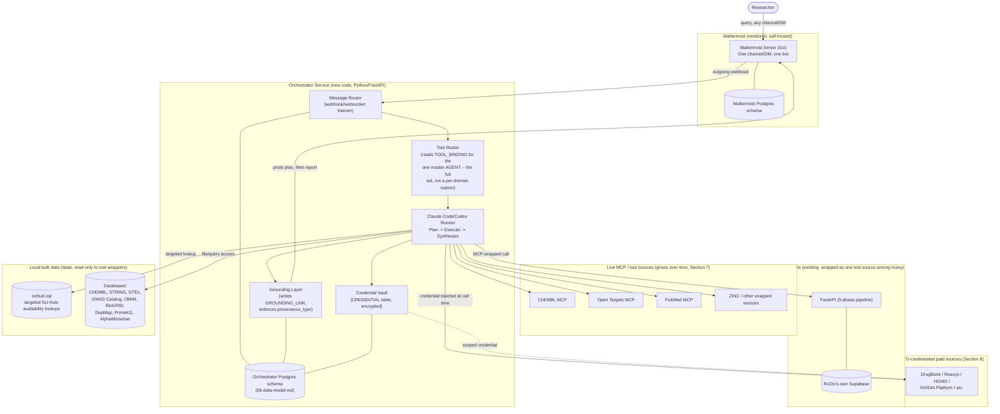

# System Architecture

## Architecture pivot (2026-08-15) — read this first

The original design in this document routed a message to *one of several domain-scoped bots* (a Literature Agent, a Drug Discovery Agent, etc.), each with its own narrow tool scope, and modeled cross-domain work as explicit hand-offs between them (`docs/06-data-model.md`'s `parent_task_id` tree). **That's not the product.** The actual model, confirmed by the user directly:

> One agent sitting on top of one Mattermost chat. The user enters a query. The agent understands it, lists a methodology, checks which tools are available (literature search, ChEMBL lookup, ZINC molecule download, etc. — separate MCPs/tool sources, but not separate bots), then autonomously executes the plan and reports back with real data and grounding. Like puzzle pieces controlled by one master piece, which assembles the puzzle differently every time based on what's asked.

Concretely: **one master orchestrator agent**, with the *entire* tool roster attached (PubMed, ChEMBL, Open Targets, ZINC, RxDis-wrapped pipeline steps, and everything Section 7's wrapping strategy adds over time). Per query, that one agent runs a **Plan → Execute → Synthesize** loop:

1. **Plan** — understands the request, drafts an explicit methodology naming which tools/sources it intends to use and why. This plan is shown to the user, not hidden — it's the "which puzzle pieces, in what order" step.
2. **Execute** — autonomously calls whatever the plan calls for, across as many tools as needed, in whatever order the task actually requires (not fixed per-domain routing).
3. **Synthesize** — compiles a grounded report from what the tool calls actually returned, posts it back.

What survives from the original design, unchanged: Mattermost as the messaging layer, the Orchestrator Service as the thing that runs the loop, the Grounding Layer's `provenance_type`/`GroundingLink` enforcement, the Credential Vault, RxDis as a wrapped tool source (not a merged codebase). What changes: there is no per-domain `Agent` row to route to and no bot-to-bot hand-off tree — there's one agent whose `TOOL_BINDING` rows span the full roster, and the "planning" that used to be implicit in *which bot the user picked* is now an explicit, visible step the agent itself produces.

## Guiding decisions (and why)

1. **Mattermost is a dependency, not a fork.** We run its official server binary/container and build against its Bot Accounts, Slash Commands, Outgoing Webhooks, and Websocket Event API. We never modify Mattermost's own source. This keeps upgrades trivial and matches the "extend by wrapping, not rewriting" goal.
2. **Claude Code/Codex is the orchestration engine, not a library we reimplement.** The Orchestrator Service's job is running the Plan→Execute→Synthesize loop and grounding (attach provenance to output) — the actual reasoning-plus-tool-use loop is Claude Code/Codex's job, configured with the *entire* available MCP toolset, not a pre-scoped subset.
3. **Local-first means self-hosted, not "no compute."** Paid compute (NVIDIA Platform, cloud GPU) is invoked *from* the local Orchestrator using the org's own account — nothing routes through a third-party-hosted backend of ours, because there isn't one (see Section 11 of the research report).
4. **RxDis is wrapped, not merged.** Its FastAPI service keeps running as-is (own process, own Supabase connection); the Orchestrator calls it as an MCP-wrapped tool source rather than importing its code inline. Reduces integration risk and keeps RxDis independently runnable/debuggable. It's one entry in the master agent's tool roster, not a second bot.

## Component diagram

## Layer-by-layer

### Messaging layer — Mattermost
Off-the-shelf, containerized (official Docker image or single Go binary), Postgres-backed. Owns its own schema. We interact only through its public APIs (Bot Accounts, Outgoing Webhooks for inbound messages, REST API for posting messages/attachments, Websocket API for real-time where needed). Chosen over Rocket.Chat for the Postgres alignment with the rest of the stack and its more mature bot ecosystem (see `01-project-goals.md`'s decision log — Mattermost is Go + React + Postgres, MIT core). **One bot account** is what the user actually talks to — not one per domain.

### Orchestrator Service — new code
Python/FastAPI, chosen to match RxDis's existing stack (easier to wrap RxDis's FastAPI endpoints directly). Responsibilities:
- **Message Router:** receives Mattermost outgoing-webhook events, creates a `TASK` row against the one master `AGENT`.
- **Tool Roster:** reads the master `AGENT`'s `TOOL_BINDING` rows (see `06-data-model.md`) — the *entire* set of wired tool sources, not a per-domain subset — to build the MCP server configuration Claude Code/Codex needs for this run. Growing the roster (wiring a new tool source per Section 7's strategy) is the primary way this platform gets more capable; it does not require standing up a new bot or new routing logic.
- **Claude Code/Codex Runner — Plan → Execute → Synthesize:** invokes the agentic loop (via the Claude Agent SDK) with the *full* resolved tool roster available for every query. The system prompt requires the model to (1) state its methodology — which tools it intends to use and why — before acting, (2) execute against that plan, calling whatever tools the task actually needs, (3) synthesize a final grounded report. The stated methodology is itself posted to the user, not just internal reasoning — this is the "show which puzzle pieces get assembled" requirement. **Critical isolation requirement, found the hard way in Phase 1:** `ClaudeAgentOptions(allowed_tools=[...])` alone does *not* sandbox a run — the SDK's default (`setting_sources=None`) still loads the host's `~/.claude/settings.json` and every personal MCP connector configured there. A real Phase 1 test run used the developer's own personal PubMed/Gmail/etc. connectors instead of the intended tool, silently, with no error. **`setting_sources=[]` is required** on every run — without it, the tool roster is not actually enforced, which is both a correctness bug (wrong tool, wrong grounding) and a security one.
- **Grounding Layer:** intercepts the runner's tool-call trace, writes `TOOL_CALL`/`GROUNDING_LINK` rows, and refuses to let a response post without a `provenance_type` set (the structural enforcement described in `06-data-model.md`).

### Credential Vault
A table (`CREDENTIAL`) with values encrypted at rest using a locally-held key (Fernet at MVP scope — see `10-build-plan.md` for the key-management hardening still owed). Credentials are injected into a tool call at request time by the Orchestrator, never handed to Claude Code/Codex as a long-lived secret in its own context — this matters because MCP tool calls and their arguments may be logged/traced, and a credential shouldn't be recoverable from that trace.

### RxDis integration
RxDis keeps running as its own FastAPI service against its own Supabase instance — no code merge. The Orchestrator wraps RxDis's existing endpoints (trigger a phase/pipeline run, poll status) as MCP tool calls, so from the master agent's perspective, RxDis is just more entries in its tool roster — the same pattern as ChEMBL or Open Targets, not a second bot to route to.

### Local bulk data access
`data/scihub.sql` and `data/Databases/` are read-only inputs to tool wrappers, not imported into the Orchestrator's own schema (see `06-data-model.md` for why). `scihub.sql` specifically is used for targeted, query-time Sci-Hub-availability lookups (`grep -F -f`, ~50-60s/query, I/O-bound — see `10-build-plan.md` Phase 0 for how this was proven), not bulk-imported.

### Live MCPs and BYO-credentialed sources
ChEMBL/Open Targets/PubMed are already live; the Orchestrator's Claude Code/Codex Runner includes the entire wired set in the master agent's tool roster for every run — there's no per-domain gating anymore. BYO-credentialed sources (Section 8) are the same MCP-call pattern, with the Vault injecting the credential at call time.

### Compute layer (Gap 7) — check Hugging Face before buying anything

The research report's Section 8 named NVIDIA Platform (BioNeMo/NIM) and general cloud GPU compute as the "buy" path for Gap 7 (no compute/sandbox layer). Section 10 of the same report separately flagged that **Hugging Face is already a connected MCP and was never factored into that compute decision** — it hosts lighter-weight bio models (ESM, ProtBert, DNABERT, ChemBERTa-class) that may cover a real fraction of the Structural Biology and Drug Discovery cluster's Tier-3 "needs compute" experiments (structure/sequence embedding, lightweight property prediction) without any new procurement at all. **Rule: before wiring NVIDIA Platform or provisioning cloud GPU for a given compute-blocked tool, check whether a Hugging Face-hosted inference endpoint already answers it.** Reserve NVIDIA/cloud GPU for the genuinely heavy workloads Hugging Face's hosted inference can't cover — full AlphaFold-class structure prediction at scale, docking, MD simulation.

**AlphaFold Server compliance trap:** Google DeepMind's free hosted folding tool (distinct from the AlphaFold DB precomputed-model lookup) has a **non-commercial-only terms of service**. The master agent must not route a commercial-tier org's request to AlphaFold Server even though it's free and would otherwise look like the obvious lightweight option — this needs to be an explicit check gated on the requesting `ORG`'s tier, not a documentation footnote that gets missed at implementation time.

## Deployment topology (MVP)

Single machine or single org server, `docker-compose`-orchestrated: Mattermost container + its Postgres, Orchestrator Service container + its Postgres (one instance, two databases — see `06-data-model.md`), RxDis's existing service, and local access to `data/`. No Kubernetes, no multi-node design — that's explicitly premature for a single-org MVP (see Non-Goals in `01-project-goals.md`). **Known limitation (Phase 1):** the Claude Code/Codex Runner currently runs against the host's own authenticated `claude` CLI (venv, not containerized) — bundling the CLI plus non-interactive auth into the Orchestrator's Docker image is a distinct packaging task, not yet done (see `10-build-plan.md`).

## What this architecture defers (intentionally)

- The sandboxed tool-runner for CLI/binary bio.tools (Section 7 Phase 2 of the research report) — not needed until a planned task requires a local-execution tool rather than an API-callable one.
- Multi-tenant credential vault hardening (Section 8/11 Appendix) — single-org scope doesn't need it yet, but the schema (`06-data-model.md`) is shaped so adding org-level isolation later doesn't require a redesign.
- The canvas/side-panel UI — link-out only at MVP (see `05-ux-behavior.md` §3). The methodology + report for a complex multi-tool run can get long; this is where a canvas view will matter most.
- Multi-turn plan revision (user pushes back on the stated methodology before execution starts) — MVP posts the plan and proceeds; an approval gate is a real UX question for later, not designed here.

## Related documents

`06-data-model.md` · `05-ux-behavior.md` · `10-build-plan.md` · `11-backlog-traceability.md` (full status of every gap/tool/flagship this architecture touches)
