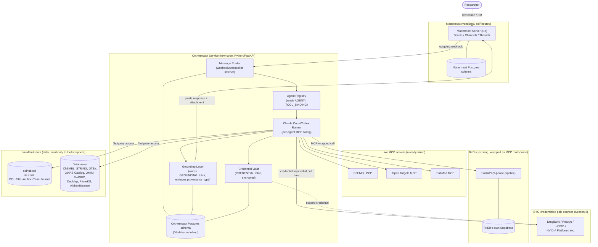

# System Architecture

## Guiding decisions (and why)

1. **Mattermost is a dependency, not a fork.** We run its official server binary/container and build against its Bot Accounts, Slash Commands, Outgoing Webhooks, and Websocket Event API. We never modify Mattermost's own source. This keeps upgrades trivial and matches the "extend by wrapping, not rewriting" goal.
2. **Claude Code/Codex is the orchestration engine, not a library we reimplement.** The Orchestrator Service's job is routing (which agent, which task) and grounding (attach provenance to output) — the actual reasoning-plus-tool-use loop is Claude Code/Codex's job, configured per agent with the relevant MCP servers.
3. **Local-first means self-hosted, not "no compute."** Paid compute (NVIDIA Platform, cloud GPU) is invoked *from* the local Orchestrator using the org's own account — nothing routes through a third-party-hosted backend of ours, because there isn't one (see Section 11 of the research report).
4. **RxDis is wrapped, not merged.** Its FastAPI service keeps running as-is (own process, own Supabase connection); the Orchestrator calls it as an MCP-wrapped tool source rather than importing its code inline. Reduces integration risk and keeps RxDis independently runnable/debuggable.

## Component diagram

## Layer-by-layer

### Messaging layer — Mattermost
Off-the-shelf, containerized (official Docker image or single Go binary), Postgres-backed. Owns its own schema. We interact only through its public APIs (Bot Accounts, Outgoing Webhooks for inbound messages, REST API for posting messages/attachments, Websocket API for real-time where needed). Chosen over Rocket.Chat for the Postgres alignment with the rest of the stack and its more mature bot/plugin ecosystem for exactly this "delegate to a bot" pattern (see `01-project-goals.md`'s decision log — Mattermost is Go + React + Postgres, MIT core).

### Orchestrator Service — new code
Python/FastAPI, chosen to match RxDis's existing stack (easier to wrap RxDis's FastAPI endpoints directly, and to eventually share tooling/patterns if RxDis code is refactored inward later). Four responsibilities:
- **Message Router:** receives Mattermost outgoing-webhook events, resolves which `AGENT` was addressed, creates a `TASK` row.
- **Agent Registry:** reads `AGENT`/`TOOL_BINDING` (see `06-data-model.md`) to build the per-agent MCP server configuration Claude Code/Codex needs for that task.
- **Claude Code/Codex Runner:** invokes the agentic loop (via the Claude Agent SDK) with the resolved MCP config; this is where the actual multi-step tool use happens. **Critical isolation requirement, found the hard way in Phase 1:** `ClaudeAgentOptions(allowed_tools=[...])` alone does *not* sandbox a run — the SDK's default (`setting_sources=None`) still loads the host's `~/.claude/settings.json` and every personal MCP connector configured there. A real Phase 1 test run used the developer's own personal PubMed/Gmail/etc. connectors instead of the agent's intended tool, silently, with no error. **`setting_sources=[]` is required** on every agent run (the SDK's own documented "isolation mode") — without it, an agent's tool scope is not actually enforced, which is both a correctness bug (wrong tool, wrong grounding) and a security one (a multi-tenant deployment would leak one org's/developer's personal connector access into another's agent run).
- **Grounding Layer:** intercepts the runner's tool-call trace, writes `TOOL_CALL`/`GROUNDING_LINK` rows, and refuses to let a response post without a `provenance_type` set (the structural enforcement described in `06-data-model.md`).

### Credential Vault
A table (`CREDENTIAL`) with values encrypted at rest using a locally-held key (e.g. an OS-keychain-backed key or a key file outside version control — exact key-management mechanism is a Build Plan Phase 2 decision, not finalized here; see `10-build-plan.md`). Credentials are injected into a tool call at request time by the Orchestrator, never handed to Claude Code/Codex as a long-lived secret in its own context — this matters because MCP tool calls and their arguments may be logged/traced, and a credential shouldn't be recoverable from that trace.

### RxDis integration
RxDis keeps running as its own FastAPI service against its own Supabase instance — no code merge. The Orchestrator wraps RxDis's existing endpoints (trigger a phase/pipeline run, poll status) as MCP tool calls, so from Claude Code/Codex's perspective, RxDis is just another tool source, same as ChEMBL or Open Targets. This is the fastest path to a working second agent and matches the "wrap, don't rewrite" goal directly.

### Local bulk data access
`data/scihub.sql` and `data/Databases/` are read-only inputs to tool wrappers, not imported into the Orchestrator's own schema (see `06-data-model.md` for why). Practically: a lightweight local database process (MySQL/MariaDB for `scihub.sql` since it's a MySQL dump, or a DuckDB conversion for faster analytical queries — decision deferred to Build Plan Phase 0's data-audit task) serves these to tool wrappers over a local connection, never exposed outside the host.

### Live MCPs and BYO-credentialed sources
No change from how they work today (ChEMBL/Open Targets/PubMed already live) — the Orchestrator's Claude Code/Codex Runner simply includes them in an agent's MCP config. BYO-credentialed sources (Section 8) are the same MCP-call pattern, with the Vault injecting the credential at call time instead of the call being anonymous/public.

### Compute layer (Gap 7) — check Hugging Face before buying anything

The research report's Section 8 named NVIDIA Platform (BioNeMo/NIM) and general cloud GPU compute as the "buy" path for Gap 7 (no compute/sandbox layer). Section 10 of the same report separately flagged that **Hugging Face is already a connected MCP and was never factored into that compute decision** — it hosts lighter-weight bio models (ESM, ProtBert, DNABERT, ChemBERTa-class) that may cover a real fraction of the Structural Biology and Drug Discovery cluster's Tier-3 "needs compute" experiments (structure/sequence embedding, lightweight property prediction) without any new procurement at all. **Rule for Phase 5 (`10-build-plan.md`): before wiring NVIDIA Platform or provisioning cloud GPU for a given compute-blocked experiment, check whether a Hugging Face-hosted inference endpoint already answers it.** Reserve NVIDIA/cloud GPU for the genuinely heavy workloads Hugging Face's hosted inference can't cover — full AlphaFold-class structure prediction at scale, docking, MD simulation.

**AlphaFold Server compliance trap:** Google DeepMind's free hosted folding tool (distinct from the AlphaFold DB precomputed-model lookup wired in Phase 4) has a **non-commercial-only terms of service**. The Structural Biology Agent (Phase 4) must not route a commercial-tier org's request to AlphaFold Server even though it's free and would otherwise look like the obvious lightweight option — this needs to be an explicit check in the agent's tool-selection logic (gated on the requesting `ORG`'s tier, same table already tracking BYO-credential scope in `06-data-model.md`), not a documentation footnote that gets missed at implementation time.

## Deployment topology (MVP)

Single machine or single org server, `docker-compose`-orchestrated (matching RxDis's own prior pattern, kept consistent): Mattermost container + its Postgres, Orchestrator Service container + its Postgres (or shared instance/separate schema — see `02-prd.md` open question), RxDis's existing service (already docker-composed in its own reference setup), and the local data-serving process for `data/`. No Kubernetes, no multi-node design — that's explicitly premature for a single-org MVP (see Non-Goals in `01-project-goals.md`).

## What this architecture defers (intentionally)

- The sandboxed tool-runner for CLI/binary bio.tools (Section 7 Phase 2 of the research report) — not needed until an agent beyond Drug Discovery/Literature requires a local-execution tool rather than an API-callable one.
- Multi-tenant credential vault hardening (Section 8/11 Appendix) — single-org scope doesn't need it yet, but the schema (`06-data-model.md`) is shaped so adding org-level isolation later doesn't require a redesign.
- The canvas/side-panel UI — link-out only at MVP (see `05-ux-behavior.md` §3).

## Related documents

`06-data-model.md` · `05-ux-behavior.md` · `10-build-plan.md` · `11-backlog-traceability.md` (full status of every gap/tool/flagship this architecture touches)
